

# [MobileNets](https://arxiv.org/abs/1704.04861)
###### : Efficient Convolutional Neural Networks  for Mobile Vision Applications

 

##### 2021. 08. 03. 
#### 이동건

---
## 0. Contents
1. Introduction
2. Prior Work<!-- Section 2 reviews prior work in building small models.  -->
3. MobileNet Architecture<!-- Section 3 describes the MobileNet architecture and two hyper-parameters width multiplier and resolution multiplier to define smaller and more efficient MobileNets.  -->
3.1. Depthwise Separable Convolution
3.2. Network Structure and Training
3.3. Width Multiplier: Thinner Models
3.4. Resolution Multiplier: Reduced Representation
---
## 0. Contents
4. Experiments<!-- Section 4 describes experiments on ImageNet as well a variety of different applications and use cases.  -->
4.1. Model Choices
4.2. Model Shrinking Hyperparameters
4.3. Fine Grained Recognition
4.4. Large Scale Geolocalizaton
4.5. Face Attributes
4.6. Object Detection
4.7. Face Embeddings
5. Conclusion<!-- Section 5 closes with a summary and conclusion. -->
6. References
---

## 1. Introduction

- **efficiency** > accuracy

- Desirable Properties
    - Sufficiently high accuracy
    - Low computational complexity
    - Low energy usage
    - Small model size

---
## 1. Introduction
- AlexNet 이후로 <!--CNN은 다양한 vision 분야에서 사용되고 있다.--> <!--모델의 -->accuracy를 높이기 위해 layer를 더욱 깊게 쌓아 네트워크의 depth를 늘리는 것이 일반적인 트렌드가 되었다.
- Deep한 네트워크를 설계하여 accuracy를 개선하는 것은 모델의 size, speed와 같은 efficiency 측면에서 볼 때 문제가 될 수 있다.
- Real world에서는 computer resource가 제한적이기 때문에 문제가 된다.
 
- 본 논문에서는 small, low latency model을 설계하기 위한 방법을 통해,  efficient network architecture를 제안한다.
---

## 1. Introduction

- Small Deep Neural Network의 중요성
  - network를 작게 만들면 학습이 빠르게 될 것이고, 
  임베디드 환경에서 딥러닝을 구성하기에 더 적합해짐
  - 무선 업데이트로 Deep Neural Network를 업데이트 해야한다면, 
  적은 용량으로 빠르게 업데이트 해주어야
  업데이트의 신뢰도와 통신 비용 등에 도움이 될 것

---
## 2. Prior Work<!-- Section 2 reviews prior work in building small models.  -->
###### Small Deep Neural Network 기법
- Remove Fully-Connected Layers
    - 파라미터의 90% 정도가 FC layer에 분포되어 있는만큼, FC layer를 제거하면 경량화가 됨
    - CNN기준으로 필터(커널)들은 파라미터 쉐어링을 해서 다소 파라미터의 갯수가 작지만, FC layer에서는 파라미터 쉐어링을 하지 않기 때문에 엄청나게 많은 수의 파라미터가 존재하게 됨

- Kernel Reduction (3 x 3 → 1 x 1)
    - (3 x 3) 필터를 (1 x 1) 필터로 줄여 연산량 또는 파라미터 수를 줄이는 기법
    - 이 기법은 대표적으로 SqueezeNet에서 사용됨
---
- Shuffle Operation
- Evenly Spaced Downsampling
    - Downsampling 하는 시점과 관련되어 있는 기법
    - Downsampling을 초반에 많이 할 것인지 아니면 후반에 많이 할 것인지 선택하게 되는데, 그것을 극단적으로 하지 않고 균등하게 하자는 컨셉
    - 초반에 Downsampling을 많이하게 되면 네트워크 크기는 줄게 되지만, feature를 많이 잃게 되어 accuracy가 줄어들게 되고
    - 후반에 Downsampling을 많이하게 되면 accuracy 면에서는 전자에 비하여 낫지만 네트워크의 크기가 많이 줄지는 않게됨
    - 따라서 이것의 절충안으로 적절히 튜닝하면서 Downsampling을 하여 Accuracy와 경량화 두 가지를 모두 획득하자는 것

---

- Channel Reduction : MobileNet 적용
    - Channel 숫자룰 줄여서 경량화
- **Depthwise Seperable Convolution** : MobileNet 적용
    - 이 컨셉은 [L.Sifre의  Ph. D. thesis](https://www.di.ens.fr/data/publications/papers/phd_sifre.pdf)에서 가져온 컨셉이고 
    이 방법으로 경량화를 할 수 있다.
- Distillation & Compression : MobileNet 적용

---
## 2. Prior Work<!-- Section 2 reviews prior work in building small models.  -->

- 최근에도 small and efficient neural network를 설계하기 위한 연구가 있지만 기존의 방법들은 pretrained network를 압축하거나 small network를 directly하게 학습시켰던 두 분류로 나눌 수 있다.

- 본 논문에서는 제한된 latency, size 안에서 small network를 구체적으로 설계할 수 있는 아키텍처를 제안한다.
---
## 2. Prior Work<!-- Section 2 reviews prior work in building small models.  -->

> * MobileNets primarily focus on optimizing for latency but also yield small networks.
 Many papers on small networks focus only on size but do not consider speed. ㅤ*

- 제안하는 MobileNets은 latency를 최적화하면서 small network를 만드는 것에 초점을 맞춘다.

---

## 3. MobileNet Architecture<!-- Section 3 describes the MobileNet architecture and two hyper-parameters width multiplier and resolution multiplier to define smaller and more efficient MobileNets.-->

- 3.1. Depthwise Separable Convolution
- 3.2. Network Structure and Training
- 3.3. Width Multiplier: Thinner Models
- 3.4. Resolution Multiplier: Reduced Representation

---

### 3.1. Depthwise Separable Convolution
- Standard Convolution

---
### 3.1. Depthwise Separable Convolution
- VGG

---
### 3.1. Depthwise Separable Convolution
- Inception-v3
  

---
### 3.1. Depthwise Separable Convolution
- Standard Convolution

<!-- Figures from https://machinethink.net/blog/googles-mobile-net-architecture-on-iphone/ -->

---
### 3.1. Depthwise Separable Convolution
- Depthwise Convolution + Pointwise Convolution (1x1 convolution) <!-- 기존 CNN의 구조와 달리 한 방향으로만 크기를 줄이는 전략이라고 보시면 됩니다. -->
 

 <!--depthwise convolution은 채널 숫자는 줄어들지 않고 한 채널에서의 크기만 줄어듭니다.-->ㅤㅤㅤㅤ<!-- pointwise convolution은 채널 숫자가 하나로 줄어듭니다. -->

<!-- Figures from https://machinethink.net/blog/googles-mobile-net-architecture-on-iphone/ -->

---
### 3.1. Depthwise Separable Convolution
- Depthwise Convolution + Pointwise Convolution (1x1 convolution)

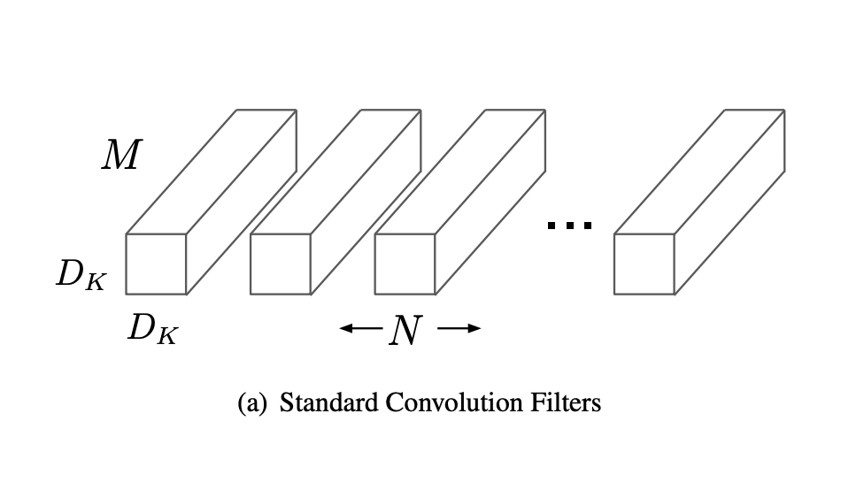ㅤㅤㅤ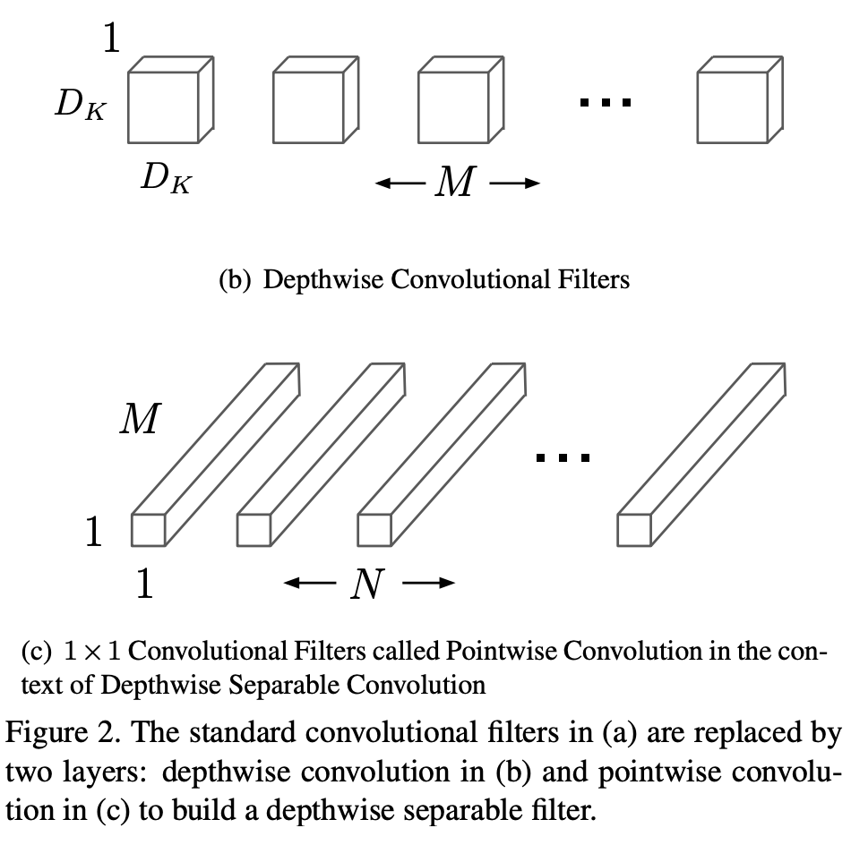

---
- $D_{K}$ = 필터의 height/width 크기
- $D_{F}$ = Feature map의 height/width 크기
- $M$ = 인풋 채널의 크기
- $N$ = 아웃풋 채널의 크기 (필터의 개수)
 
- **Standard Convolution**의 대략적 계산 비용 
    - 　$D_{K} \times D_{K} \times M \times N \times D_{F} \times D_{F}$   
- **Depthwise Separable Convolution**의 대략적 계산 비용
    - 　$D_{K} \times D_{K} \times M \times D_{F} \times D_{F} + D_{F} \times D_{F} \times M \times N$
---
- 두 Convolution의 계산 비용 차이 (**Depthwise Separable Version / Standard Version**)
    - $(D_{K} \times D_{K} \times M \times D_{F} \times D_{F} + D_{F} \times D_{F} \times M \times N) / (D_{K} \times D_{K} \times M \times N \times D_{F} \times D_{F})  = 1/N + 1/{D_{K}}^{2}$
 
- 여기서 $N$은 아웃풋 채널의 크기이고 $D_{K}$는 필터의 크기인데,
 $N$이 $D_{K}$ 보다 일반적으로 훨씬 큰 값이므로 ,
 반대로 $1 / D_{K}^{2}$ 값이 되어 $1 / D_{K}^{2}$ 배 만큼 
 계산이 줄었다고 할 수 있다.

- 이 때, $D_{K}$는 보통 $3$이므로 ${1}/{9}$ 배 정도 계산량이 감소한다.

---
### 3.2. Network Structure and Training
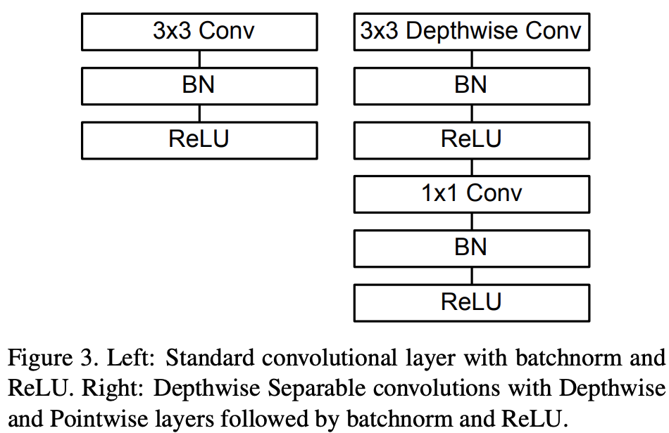

---
### 3.2. Network Structure and Training 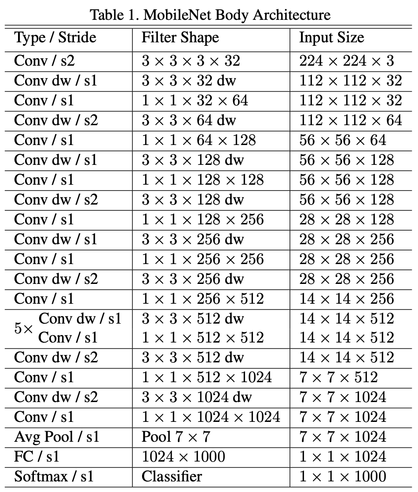ㅤ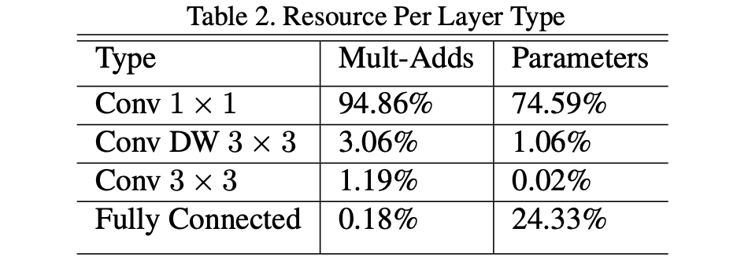

---

### 3.3. Width Multiplier: Thinner Models
### 3.4. Resolution Multiplier: Reduced Representation

- 두 값 모두 기존의 컨셉에서 조금 더 작은 네트워크를 만들기 위해 사용되는 scale 값이고 값의 범위는 $0$ ~ $1$이다. 

---

### 3.3. Width Multiplier: Thinner Models

- width multiplier는 논문에서 $\alpha$로 표현하였고, input과 output의 채널에 곱해지는 값이다.
    - 논문에서 thinner model을 위한 상수로 사용되었으며, 채널의 크기를 일정 비율 줄여가면서 실험하였다.   
- 즉, 채널의 크기를 조정하기 위해 사용되는 값으로 채널의 크기가 $M$ 이면 $\alpha M$으로 표현한다.
- 논문에서 사용된 $\alpha$ 값은 $1, 0.75, 0.5, 0.25$ 이다.

---

### 3.4. Resolution Multiplier: Reduced Representation

- 반면 resolution multiplier는 input의 height와 width에 곱해지는 상수값이다. 
- height와 width가 $D_{F}$ 이면 $\rho D_{F}$가 된다.
- 기본적으로 (224, 224, 3) 이미지를 input으로 넣고 실험할 때, 
상수 $\rho$ ($1, 0.857, 0.714, 0.571$)에 따라서 
사이즈가 변한다. (224, 192, 160 or 128)

---

### 3.3. & 3.4. Width & Resolution Multiplier

- 이렇게 width, resolution multiplier가 적용되면 계산 비용은 다음과 같이 정의된다.
  - 채널에 $\alpha$를 곱하고, feature map에는 $\rho$를 곱한다.

>$$ D_{K} \times D_{K} \times \alpha M \times \rho D_{F} \times \rho D_{F} + \alpha M \times \alpha N \times \rho D_{F} \times \rho D_{F} $$
---
### 3.3. & 3.4. Width & Resolution Multiplier
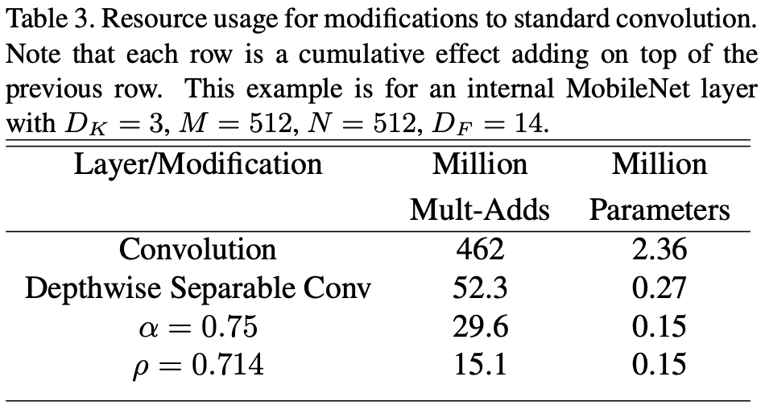

---

## 4. Experiments<!-- Section 4 describes experiments on ImageNet as well a variety of different applications and use cases.  -->
4.1. Model Choices
4.2. Model Shrinking Hyperparameters
4.3. Fine Grained Recognition
4.4. Large Scale Geolocalizaton
4.5. Face Attributes
4.6. Object Detection
4.7. Face Embeddings

---

### 4.1. Model Choices
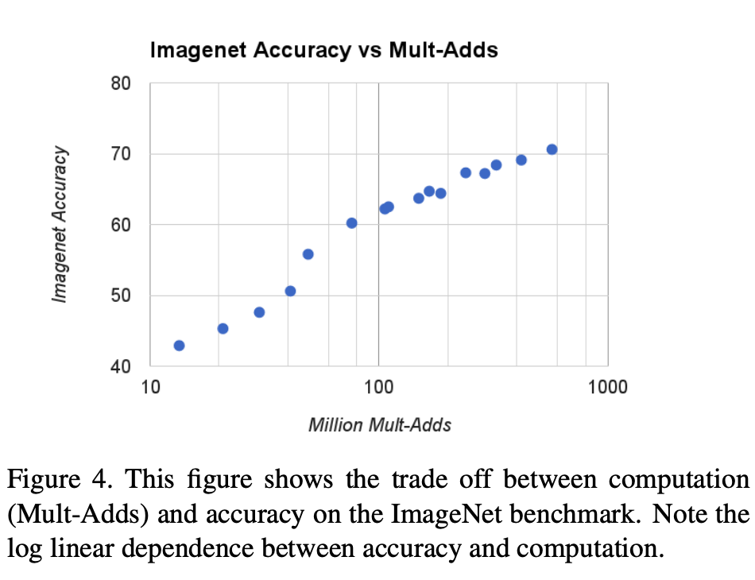 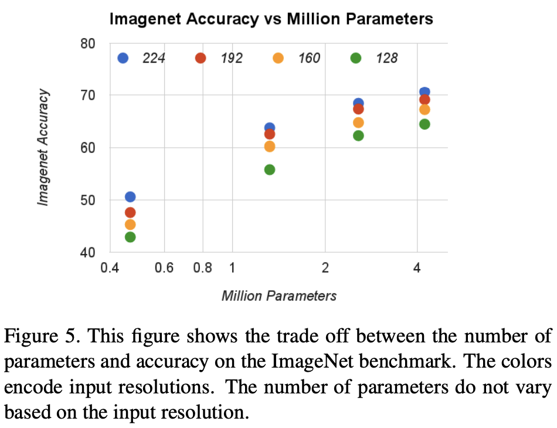

---

### 4.2. Model Shrinking Hyperparameters

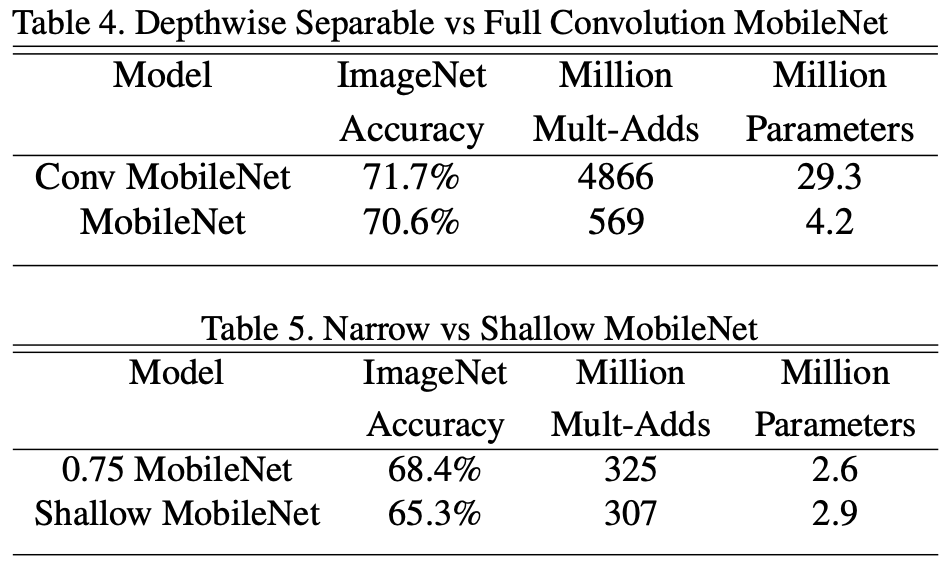 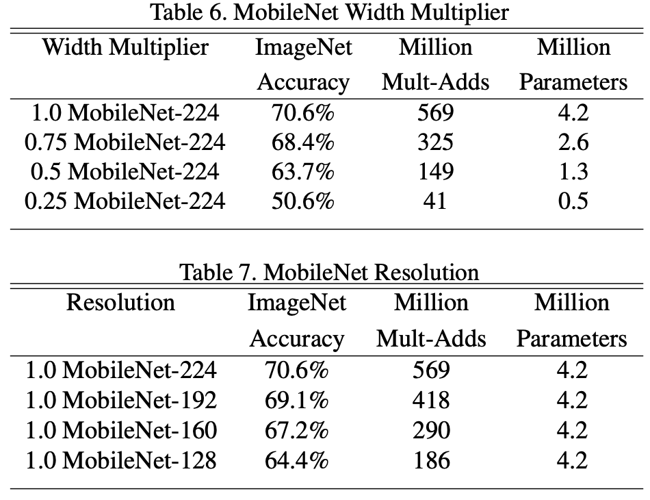

---
### 4.2. Model Shrinking Hyperparameters

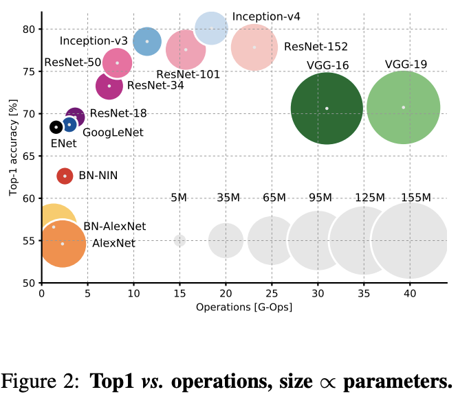 

---
### 4.2. Model Shrinking Hyperparameters

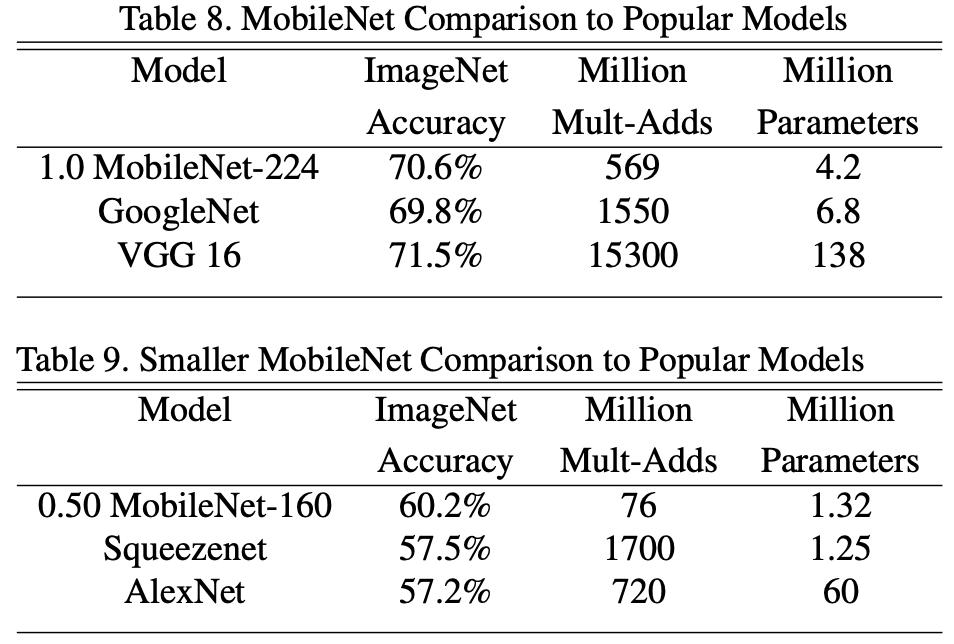

---

### 4.3. Fine Grained Recognition

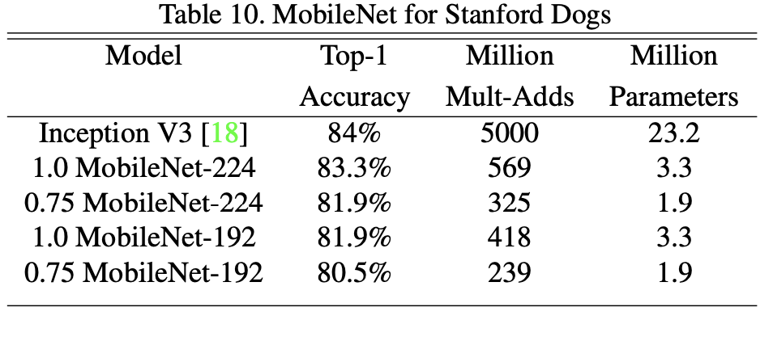

---

### 4.4. Large Scale Geolocalizaton

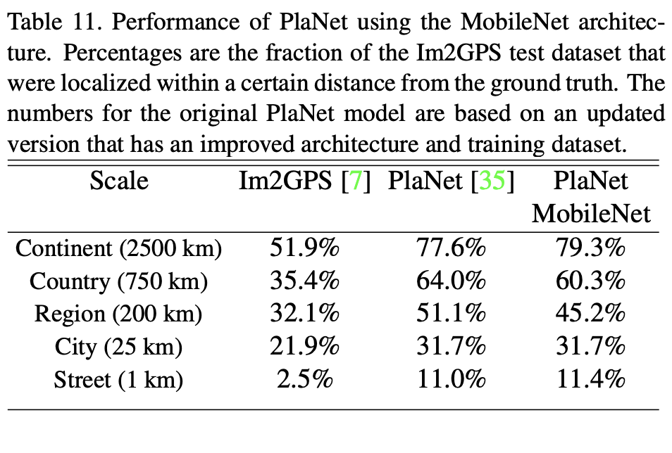

- PlaNet : 52M parameters,
5.74B multi-adds
- mobilenet : 13M parameters,
0.58M multi-adds
---

### 4.6. Object Detection
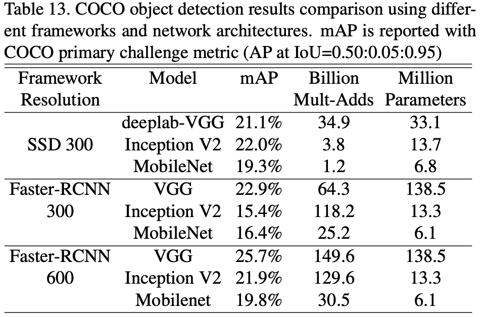 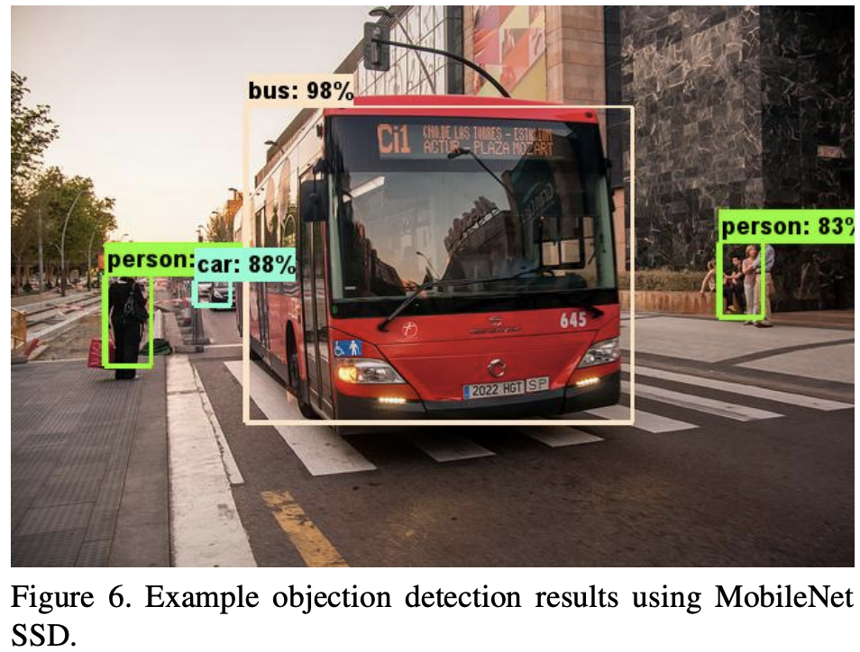

---

### 4.5. Face Attributes & 4.7. Face Embeddings

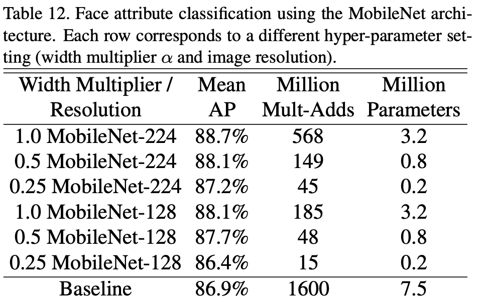 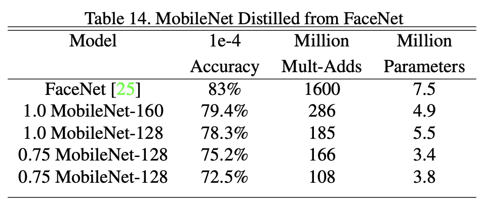

---
## 5. Conclusions
---

## 6. References
- [MobileNets: Efficient Convolutional Neural Networks for Mobile Vision Applications](https://arxiv.org/abs/1704.04861)
- [JinWon Lee YouTube - PR-044: MobileNet](https://www.youtube.com/watch?v=7UoOFKcyIvM)
- [JINSOL KIM - MobileNets~](https://gaussian37.github.io/dl-concept-mobilenet/)
- [eremo2002 - Paper Review : MobileNets~](https://eremo2002.github.io/paperreview/MobileNet/)
- [Jay S. YouTube - [AI 논문 해설] 모바일넷 MobileNet 알아보기](https://www.youtube.com/watch?v=vi-_o22_NKA)
 
- [Google’s MobileNets on the iPhone](https://machinethink.net/blog/googles-mobile-net-architecture-on-iphone/)
- [An Analysis of Deep Neural Network Models for Practical Applications](https://arxiv.org/abs/1605.07678?source=post_page---------------------------)

---
## 7. 코드 실습
### References
- [tensorflow GitHub - models/research/slim/nets/mobilenet_v1.md](https://github.com/tensorflow/models/blob/master/research/slim/nets/mobilenet_v1.md)
- [Zehaos GitHub - MobileNet/nets/mobilenet.py](https://github.com/Zehaos/MobileNet/blob/master/nets/mobilenet.py)
- [[논문 구현] PyTorch로 MobileNetV1(2017) 구현](https://deep-learning-study.tistory.com/549)
- [MG2033 GitHub - MobileNet/model.py](https://github.com/MG2033/MobileNet/blob/master/model.py)
- [eremo2002 - MobileNetV1](https://eremo2002.tistory.com/70)
---
### Applications
- [chrispolo GitHub - Mobilenet-_v1-Mask-RCNN-for-detection](https://github.com/chrispolo/Mobilenet-_v1-Mask-RCNN-for-detection)
- [hollance GitHub - MobileNet-CoreML](https://github.com/hollance/MobileNet-CoreML)