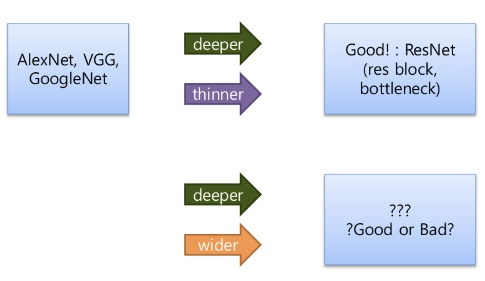

# [Wide Residual Networks](https://arxiv.org/abs/1605.07146)

#### Sergey Zagoruyko, Nikos Komodakis

 

###### 2021. 07. 08. 
###### 이동건

---

## Contents
- Introduction
    - Contribution
    - Width vs Depth in residual Networks
    - Dropout
- Representation
- Wide Residual Networks
    <!-- 
    - Representation of Residual Block
    - Representation of Network 
    -->
- Experimental Result
    <!-- 
    - Exp 1. Type of convolution in a block
    - Exp 2. Number of convolutions per block
    - Exp 3. Width of residual blocks
    - Exp 4. Dropout in residual blocks
    - Exp 5. ImageNet and COCO experiments
    - Exp 6. Computational efficiency 
    -->
- Conclusions
- References

---

## Introduction

---

<!-- ## Introduction -->
### Contributions

- ResBlock의 여러 변형을 실험을 수행하여 확인
- 새로운 widened architecture를 제안 (성능 향상 확인)
- deep residual network 내에서 dropout을 활용하는 방법 제안 <!-- 학습이 이루어지는 동안에 network를 적절하게 규제하고 overfitting을 회피하기 위해 -->
- 새롭게 제안하는 방법이 여러 dataset에서 향상된 accuracy와 속도로 SOTA

---

### Width vs Depth in residual Networks

- ResNet은 shorcut connection으로 많은 layer을 학습 할 수 있도록 하였다.
- 하지만 망이 깊어지면 깊어질 수록 의미있는 정보(context)를 갖는 필터의 수의 비가 적어지는 문제가 발생하게 되었다.

- 때문에 저자는 Block의 수를 증가시키지 않고, Residual Block의 Channel을 증가시키는 방향으로 연구를 시도하였다.

- 이 논문에서는 Residual Block을 (a), (c)의 구조와 같이 3x3 컨볼루션이 두 개로 이루어진 경우를 B(3,3)으로 표기하였다.
- 이와 마찬가지로 (b)의 경우는 B(1,3,1) (d)는 B(3,1,3)으로 표기가 가능하다.

---
## Wide Residual Networks

- 기본적인 residual block 은 다음과 같다.

$${\bf x}_{l+1} = {\bf x}_{l} + F({\bf x}_{l}, {W_l})$$

- ${x_{l+1}}$ 과 $x_{l}$ 은 network에서 $l$ 번째 unit의 input과 output을 의미하며, 
- $F$ 는 residual function 이다. (이 때의 block의 parameter는 $W_{l}$ 이다.)
---

- Residual network는 연속적으로 쌓여진 residual block으로 구성된다.

---
- residual block 는 2가지 형태의 block으로 구성
    - ***basic*** : ${[conv 3 \times 3] - [conv 3 \times 3]}$
        - 연속된 3x3 convolution으로 구성되며, batch normalization과 ReLU가 앞선 convolution에 적용되는 구조
    - ***bottleneck*** : ${[conv 1 \times 1] - [conv 3 \times 3] - [conv 1 \times 1]}$
        - 하나의 ${3 \times 3}$ convolution은 차원을 감소하고 증가시키는 ${1 \times 1}$ convolution layer에 둘러싸여 있는 구조
- Original ResNet 과 다르게 WRN은 BN, ReLU 적용 순서를 다르게 하였다.
    - *origin* : ${conv - BN - ReLU}$
    - ***our*** : ${BN-ReLU-conv}$
    - 이렇게 하면 더 빠르게 학습이 되고 더 좋은 결과를 얻는 것을 알 수 있다. 
    <!-- (origin 따윈 무시하자.) -->
---
- Residual block 을 강건(?)하게 만들 수 있는 가장 쉬운 방법은 무엇일까?
    - block 마다 conv-layer 를 추가한다.
    - 더 넓은 conv layer 를 만들기 위해 출력 feature 크기를 키운다.
    - filter 크기를 늘린다.
- 작은 filter 를 쓰는 것이 여러모로 좋다는 사실은 이미 잘 알려진 사실이다. (그래서 이를 늘리기는 부담이다.)
    - 따라서 우리는 ${3 \times 3}$ 이상 크기를 가지는 filter 를 사용하는 것을 포기한다.

---

### Dropout

- Dropout은 Coadaptive하고 overfitting을 막기 위해 많은 네트워크에 적용되어 왔다.
- 추가적으로 Internal Covariate Shift 이슈를 막기위한 Batch Norm 과 같은 방법들도 연구가 되었는데, 이 방법들은 Regularizer의 효과도 볼 수 있다. 
- 이 논문에서는 Residual Block의 컨볼루션 사이에 Dropout(Dorp rate 0.3)을 사용한다.

---
### Representation of Residual block

- ${B(3,3)}$의 경우 구조가 위와 같이 정의된다.
---

- WRN 에서는 기존 ResNet에 2개의 추가적인 factor 가 존재한다.
    - ${l}$ : block 에 포함된 conv 갯수
    - ${k}$ : conv 레이어 내에서 feature 수의 배수.
    - 예를 들어 ${l=2, k=1}$ 은 <<basic>> block 을 의미하게 된다.
---
- 다음으로 residual block 을 표현하는 방법은 다음과 같다.

- $B(M)$
    - ${M}$ 은 kernel 크기로, 예를 들어 ${3}$ 인 경우 ${3 \times 3}$ 을 나타낸다.
        - ${B(3, 3)}$ - origial <<basic>> block
        - ${B(3, 1, 3)}$ - with one extra ${1 \times 1}$ layer
        - ${B(1, 3, 1)}$ - with the same dim. of all conv. <<straightened>> bottleneck
        - ${B(1, 3)}$ - the newtork has alternating ${1 \times 1}$ - ${3 \times 3}$
        - ${B(3, 1)}$ - similar idea to the previous block
        - ${B(3, 1, 1)}$ - NiN style block

---

### Representation of Network

---

## Experimental Result
1. Type of convolution in a block
2. Number of convolutions per block
3. Width of residual blocks
4. Dropout in residual blocks
5. ImageNet and COCO experiments
6. Computational efficiency

- 실험 데이터 : CIFAR-10, CIFAR-100, SVHN, ImageNet

---

- 이 중 CIFAR-10,100 은 입력 이미지가 ${32 \times 32}$ 이고 클래스가 각각 10, 100 개
    - Data augmentation
        - 간단하게 horizontal flip 과 4 pixel 정도 padding 뒤 ranodm crop 적용
        - 과하게 augmentation 을 적용하지 않음.
---

- SVHN 은 구글 스트리트 뷰 데이터
    - 이미지 전처리를 사용하지 않음.
    - 다만 입력 pixel 을 255 로 나누어 ${[0-1]}$ 정규화 수행

- ImageNet 은 실험을 해보니 앞단에 activation 을 두는 모델의 장점이 전혀 없어서 그냥 original resnet 모델을 사용

- 좀 더 자세한 사항은 논문을 참고

---

### Exp 1. Type of convolution in a block
Residual Block의 구조 실험

- CIFAR-10 데이터를 이용해서 여러 종류의 block 타입을 확인해봄.
- 최대한 비슷한 크기의 param. 을 사용해서 결과를 얻도록 실험함.
- residual block의 구조를 바꾸어가면 실험 (${k=2}$를 유지.)
    - ${WRN-40-2}$에서 실험
        - ${B(1, 3, 1), B(3, 1), B(1,3)}$
    - ${WRN-28-2-B(3,3)}$
    - ${WRN-22-2-B(3,1,3)}$

---

---

- ${B(3,3)}$ 이 가장 우수하지만,
    - 파라미터 수 대비 ${B(3,1)}$ 과 ${B(3,1,3)}$ 도 나쁘지 않다.
- 성능상 큰 차이는 없으므로 이후 실험은 ${B(3,3)}$ 만을 가지고 실험.

---

### Exp 2. Number of convolutions per block
- ResBlock 내부의 Conv층의 개수
    - Block 내의 conv. layer 개수는 몇 개가 적당한가?

- ${WRN-40-2}$에서 ${l∈[1,2,3,4]}$로 변경하며 실험
    - 이 때 총 depth 는 유지. (${depth=40}$)

---

- ${l=2}$ 인 경우 성능이 가장 좋았다.
- 이후 실험에서는 ${l=2}$ 로 고정한다.

---

### Exp 3-1. Width of residual blocks

- 폭(width), 깊이(depth), 파라미터 개수(# of params) 실험
- WRN 의 다양한 변형 형태를 실험함.
    - ${k}$ 는 2~12 로, ${depth}$ 는 16~40 실험

---

- 같은 ${depth}$ 에서는 ➞ ${k}$ 가 클수록 (넓을수록) 우수
- 같은 ${k}$ 에서는 ➞ ${depth}$ 가 클수록 (깊을수록) 우수
- 같은 파라미터 수에는? ➞ ${depth}$ 와 ${k}$ 가 제각각. 
    - 최적의 깊이, 폭 고려가 필요하다.

---

### Exp 3-2. Width of residual blocks
- 다른 Network들과 비교
    - 앞선 실험과 비슷한 경향
    - WRN이 우수함 
        - 폭과 깊이의 적정점을 찾아냄
---

- ${WRN-28-10}$ 모델이 ${pre-act-ResNet-1001}$ 보다 0.92% 만큼 성능이 더 좋다. (동일한 batch size 128 로 학습)
        - 참고로 batch 크기를 64로 했을 때 pre-act-ResNet 의 error는 4.64. 
        (괄호 안 수치)

---

### Exp 3-3. Width of residual blocks
- ${ResNet-164}$ 와 ${WRN-28-10}$ 의 크기 차이와 학습 난이도
    - #params 차이 : 1.7M vs 36.5M
    - 파라미터가 더 많은 ${WRN-28-10}$이 ${ResNet-164}$ 보다 학습이 잘 됨.

---

### Exp 4. Dropout in residual blocks

- Dropout을 Residual Block에 적용해본 실험
<!-- - cross-validation 을 이용해서 CIFAR 데이터에는 dropout 비율을 0.3 으로 정함. (SVHN은 0.4) -->
- 대체로 dropout 사용이 유리함

<!-- 
- 확실히 효과가 있음.
- 이상한 현상을 확인함.
    - 첫번째 lr drop 이 발생하는 순간 loss 와 validation error 가 갑자기 올라가면서 흔들림.
    - 이 현상은 다음 lr drop 까지 지속됨
    - 이 현상은 weight decay 때문에 발생하지만 이 값을 낮추어버리면 accuracy 가 떨어짐.
    - dropout 을 쓰면 이 현상이 개선된다.

\

 -->

 ---

### Exp 5. ImageNet & COCO experiments

- ResNet을 늘려서 Wide ResNet 구성한 실험

- non-bottleneck ResNet-18 과 ResNet-34 로 실험.
    - 여기에 WRN 을 적용해 본다.
        - ${width}$ 를 1.0~3.0 으로 조정해 봄.
        - ${width}$ 가 증가하면 성능이 올라감.
        - 그리고 파라미터 수가 비슷하면 성능도 얼추 비슷

---

---
- 가장 우수한 결과 모음; Object-Detection
    - COCO 버전의 경우
        - MultiPathNet + LocNet + WRN-34-2
        - 34 layer 밖에 없는데도 SOTA 찍음

---

### Exp 6. Computational efficiency
계산 효율성 측정
- Thin & Deep Network (그냥 ResNet을 의미) 은 GPU 활용이 어려운데 기본적으로 sequential 연산이기 때문
    - 성능을 올리려면 당연히 최적화가 필요

- Titan.X 로 간단하게 forward+backward+update 연산을 계산해 봄
    - batch 크기는 32를 사용

---
- ${ResNet-1001}$ 과 ${WRN-40-4}$ 를 비교
    - 비슷한 정확도를 보임
    - 8배의 속도 차이

---

## Conclusions
- 여러 가지 ResBlock 구조에 대한 고찰
- 깊이와 폭을 동시에 고려
- Dropout과 ResBlock을 조합하는 새로운 방법
- 우수한 결과
- 폭이 넓은 구조가 계산에 유리함을 실험으로 증명

---
## References
1. [Wide Residual Networks](https://arxiv.org/abs/1605.07146)
2. ['Paper Summarization.' - norman3](https://norman3.github.io/papers/docs/wide_resnet.html) & [github](https://github.com/norman3/papers/blob/master/docs/wide_resnet.md)
3. ['Review Wide Resnet' - Woojin Jeong - slideshare](https://www.slideshare.net/WoojinJeong5/wide-resnet)
4. [AiRLab. Research Blog — Wide Residual Networks](https://blog.airlab.re.kr/2019/07/WRN)
5. [[논문 읽기] WRN(2016) 리뷰, Wide Residual Networks](https://deep-learning-study.tistory.com/519)
6. cumulu-s.tistory.com : [paper review](https://cumulu-s.tistory.com/35) & [code review](https://cumulu-s.tistory.com/36)

- [szagoruyko/wide-residual-networks](https://github.com/szagoruyko/wide-residual-networks) & [Wide ResNet | PyTorch](https://pytorch.org/hub/pytorch_vision_wide_resnet/)
- [PeterKim1/paper_code_review/7. Wide Residual Networks(WRN)](https://github.com/PeterKim1/paper_code_review/tree/master/7.%20Wide%20Residual%20Networks(WRN))
- [J911/WRN-pytorch](https://github.com/J911/WRN-pytorch)
